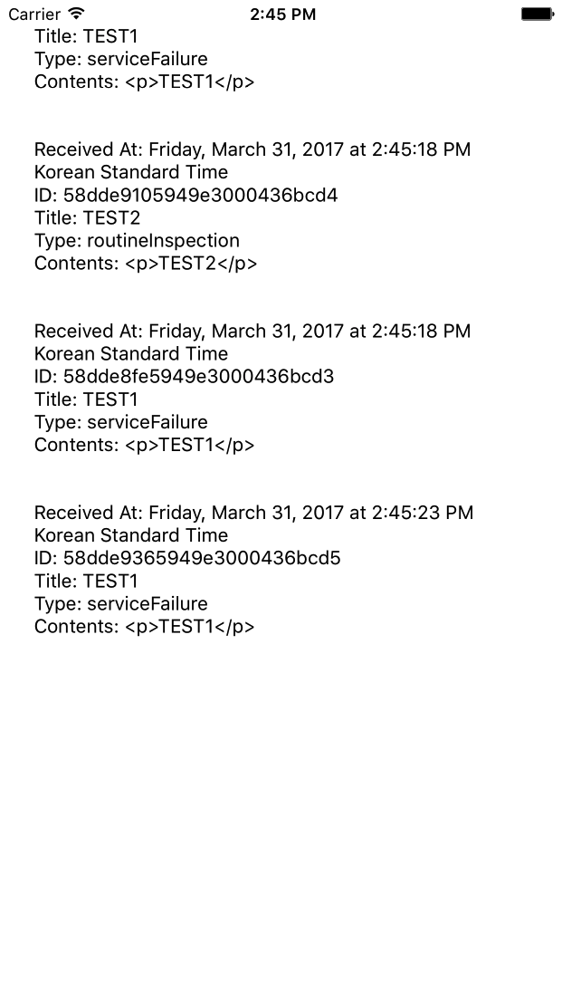

# [SimpleNotifier](https://github.com/ridibooks/simple-notifier) Client for iOS

## Requirements

- Xcode 8.0+
- Swift 3
- iOS8+

## Getting Started

You need to install the [CocoaPods](https://cocoapods.org/) to add this library as a dependency in your project.

> gem install cocoapods

Add the line below to the Podfile of your project.

> pod 'SimpleNotifier', :git => 'https://github.com/ridibooks/simple-notifier-ios', :tag => '0.1.0'

From terminal, navigate to the directory containing the Podfile, then

> pod install

For more details, please have a look at the SimpleNotifier-Demo Xcode project in this repository, and the podspec file.
